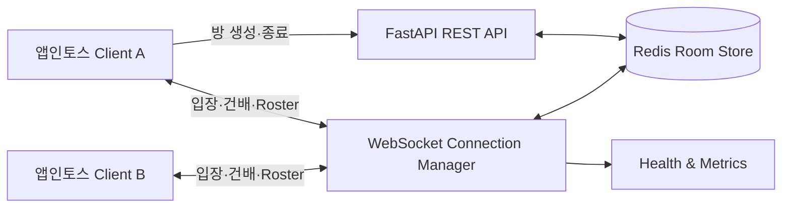
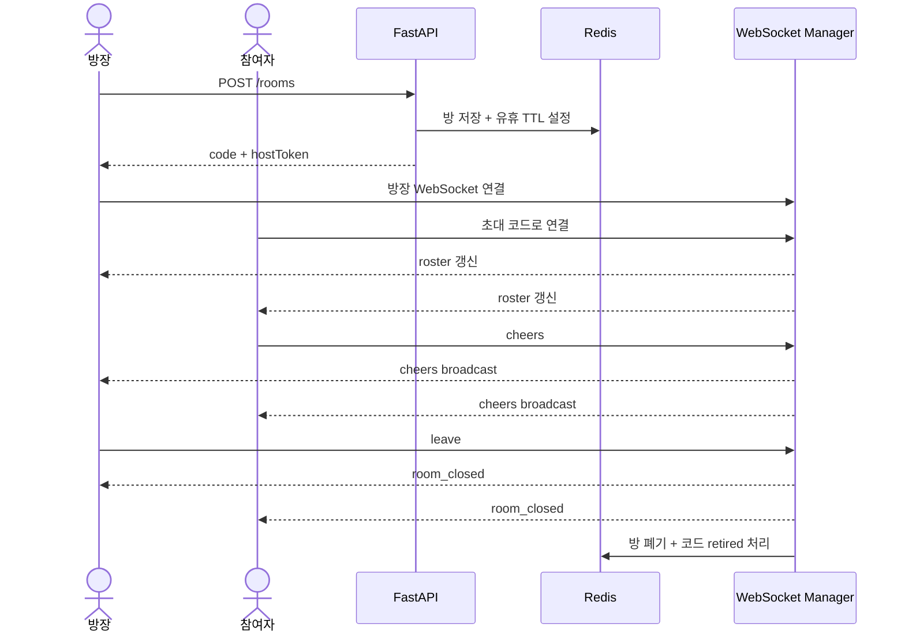

<div align="center">
  

# 건강폰술 Realtime Server

### 실제 음주 없이, 폰으로 함께 따르고 건배하는 소셜 미니앱

앱인토스 WebView에서 여러 사용자의 가상 건배 경험을 실시간으로 연결하는
FastAPI · WebSocket 백엔드입니다.

[](https://www.python.org/)
[](https://fastapi.tiangolo.com/)
[](https://redis.io/)
[](https://github.com/hj1016/phonesul_backend/actions/workflows/ci.yml)

[Client Repository](https://github.com/KOPO-200OK/phonesul) · [Team Backend Repository](https://github.com/KOPO-200OK/phonesul_backend)

</div>

> 이 저장소는 팀 프로젝트 백엔드를 기반으로 제 역할과 기술적 의사결정을 정리한 포트폴리오용 포크입니다. 팀 원본과 변경 이력은 분리되어 있습니다.

## 프로젝트 소개

건강폰술은 실제 술을 마시지 않고도 스마트폰으로 음료를 따르고, 같은 방의 사용자들과 동시에 “짠” 할 수 있는 절주·대체형 소셜 WebApp입니다. 클라이언트는 앱인토스 WebView에서 실행되며, 이 서버는 방 생성부터 실시간 참여·건배·종료까지의 수명주기를 담당합니다.

### 핵심 기능

- 초대 코드와 방장 토큰을 이용한 실시간 건배방 생성
- WebSocket 연결 기반 익명 참여와 인원 현황 동기화
- 모든 참여자에게 건배 이벤트 동시 broadcast
- 방장 종료, 일반 참여자 퇴장, 재연결 흐름 분리
- Redis TTL 기반 유휴 방 만료와 폐기 코드 재사용 방지
- 코드 추측 시도 제한과 안전한 토큰 비교
- 연결 수·활성 방 수·이벤트 루프 지연 관측

## 담당 역할

**Project Lead (전체 팀장) | Client Direction & Human Review**

- 전체 팀장으로서 서비스 방향, 개발 우선순위와 클라이언트 및 백엔드 협업 조율
- 클라이언트 기능 범위와 사용자 흐름을 중심으로 구현 방향 결정 및 결과물 검수
- AI 에이전트가 작업 기준과 프로젝트 맥락을 이해할 수 있도록 Markdown 지침 문서 작성
- AI 에이전트 개발 플로우에서 코드 변경을 검토하고 사람이 승인하는 단계 담당
- FastAPI와 WebSocket 기반 실시간 건배방 서버 설계 및 구현 참여
- Redis 상태 저장소와 TTL 정책을 도입해 서버 재시작 내구성 보강
- 동시 broadcast, 방장 권한, 만료·재연결·남용 방지 예외 흐름 검증
- `pytest` 51개 자동 테스트와 GitHub Actions CI 구성
- Docker 및 Fly.io 배포 환경 구성

## 시스템 구성



### 건배방 흐름



## 신뢰성과 운영 설계

| 문제 | 대응 |
| --- | --- |
| 서버 재시작 후 방 정보 소실 | 방 메타데이터를 Redis에 저장해 재연결 시 복구 |
| 유휴 방과 폐기 코드 누적 | Redis TTL로 자동 만료 및 정리 |
| 한 참여자의 전송 실패가 전체 broadcast 중단 | `asyncio.gather` 기반 동시 전송과 개별 실패 격리 |
| 방 코드 무차별 대입 | 클라이언트별 실패 횟수 제한 |
| 방장 사칭 | 고엔트로피 토큰과 상수 시간 비교 적용 |
| 이벤트 루프 포화 시점 불명확 | `/metrics`에서 연결·방·loop lag 관측 |
| 변경으로 인한 실시간 흐름 회귀 | fakeredis 기반 단위·통합 테스트 51개와 CI 자동 검증 |

## API 요약

| Method | Endpoint | 설명 |
| --- | --- | --- |
| `GET` | `/health` | 서버 상태 확인 |
| `GET` | `/metrics` | 연결 수, 방 수, 이벤트 루프 지연 확인 |
| `POST` | `/rooms` | 방 생성 및 초대 코드·방장 토큰 발급 |
| `POST` | `/rooms/{code}/close` | 방장 토큰 검증 후 방 종료 |
| `WS` | `/ws/{code}` | 참여·Roster·건배·퇴장 실시간 처리 |

주요 WebSocket 메시지 타입은 `joined`, `roster`, `cheers`, `leave`, `room_closed`, `error`입니다.

## 기술 스택

| 영역 | 기술 |
| --- | --- |
| Backend | Python 3.11, FastAPI, Uvicorn |
| Realtime | WebSocket, asyncio |
| State Store | Redis, fakeredis |
| Test | pytest, pytest-asyncio |
| CI/CD | GitHub Actions, Docker, Fly.io |

## 로컬 실행

```bash
git clone https://github.com/hj1016/phonesul_backend.git
cd phonesul_backend

python -m venv .venv
source .venv/bin/activate  # Windows: .venv\Scripts\Activate.ps1
pip install -r requirements.txt
```

실행 전 Redis를 준비하고 접속 주소를 환경변수로 주입합니다.

```bash
docker run -d --name phonesul-redis -p 6379:6379 redis:7
export REDIS_URL=redis://localhost:6379/0
uvicorn app.main:app --reload --host 0.0.0.0 --port 8000
```

테스트는 fakeredis를 사용하므로 별도 Redis 없이 실행됩니다.

```bash
pip install -r requirements-dev.txt
python -m pytest -q
```

## 현재 운영 범위와 한계

- WebSocket 연결과 방 멤버십은 프로세스 로컬이므로 현재는 **단일 프로세스·단일 인스턴스**를 전제로 합니다.
- 다중 인스턴스로 확장하려면 Redis Pub/Sub 등의 broadcast 중계 계층이 필요합니다.
- 유휴 TTL 만료 시 연결된 사용자에게 `room_closed`를 능동 통지하는 흐름은 후속 과제입니다.
- 방장 토큰은 현재 WebSocket 쿼리 파라미터로 전달되므로 운영 로그 마스킹 또는 첫 메시지 인증 방식 전환이 필요합니다.
- 출시 전 앱인토스 WebView의 실제 Origin을 확정해 허용 목록을 제한해야 합니다.

## 프로젝트 구조

```text
app/
├── main.py                 # REST·WebSocket 진입점과 수명주기
├── connection_manager.py   # 방별 연결·Roster·broadcast
├── room_store.py           # Redis 방 상태와 TTL
├── abuse.py                # 코드 추측 시도 제한
├── messages.py             # 실시간 메시지 계약
└── models.py               # Room·Member 도메인

tests/                      # 51개 단위·통합·안정성 테스트
docs/spec/                  # 백엔드 기능 정의
```
